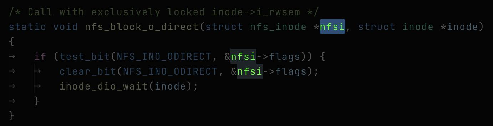

# Luminol

## Features

- Quick file-based highlighting, navigation, and selection
- That's it!

Place the cursor on a keyword and use `Luminol: Toggle Highlights` (from the command palette, or assign yourself a keybinding) - all full-word matches will be highlighted and everything else goes dim. Select a section of text instead and partial matches will be included.

`Luminol: Move to Next/Previous` will skip through the matching text. If there is no highlighting active when you use next/previous, highlights will be found as above (so you don't really need `Luminol: Toggle Highlight` itself).

Use `Luminol: Clear Highlights` or change your selection to return colors to normal.

`Luminol: Highlight and Select` will highlight and also select all instances of the string.

No default keybindings have been provided. I bind `Ctrl+Shift+Up/Down` to `Move Previous/Next`, and `Ctrl+Shift+A` is bound to `Highlight and Select`.

Requirements

- Visual Studio Code

## Extension Settings

- `luminol.highlightColor`: The color for the highlights.

- `luminol.soleHighlightColor`: The color for the highlight when the selection is unique in the file.

- `luminol.dimColor`: The color for everything else that doesn't match.

## Known Issues

- None. Yet.

## Release Notes

### 1.0.3

- Color settings done properly

### 1.0.0

- Initial release
